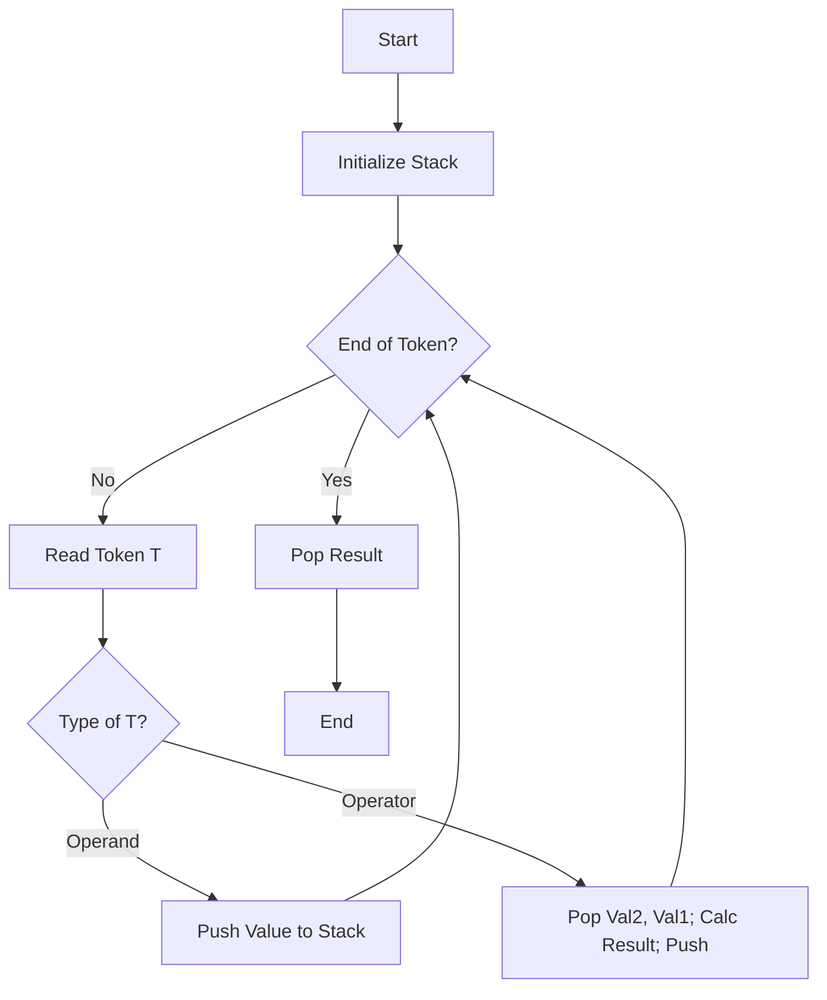

# PROJECT REPORT: Expression Converter and Evaluator Using Stack

**Submitted by:** [User Name]  
**Date:** [Current Date]  
**Subject:** Data Structures & Algorithms

---

## 1. Abstract
This project implements a C++ application that performs operations on algebraic expressions using the Stack data structure. The primary features include converting Infix expressions to Postfix and Prefix notations and evaluating Postfix expressions. The program handles operator precedence, associativity, and multi-digit numbers, providing a user-friendly console interface.

## 2. Introduction
In computer science, parsing algebraic expressions is a fundamental problem. Standard arithmetic is written in *Infix* notation (e.g., `A + B`), which is easy for humans but hard for computers to evaluate due to precedence rules and parentheses. *Postfix* (Reverse Polish Notation) and *Prefix* (Polish Notation) are easier for machines to process. This project demonstrates the practical application of the **Stack** data structure to solve these conversion and evaluation problems efficiently.

## 3. Methodology
The project is built using C++ and the Standard Template Library (STL).
- **Data Structure**: `std::stack` is used for LIFO (Last-In-First-Out) operations.
- **Class Structure**: `ExpressionManager` encapsulates all logic.
- **Interface**: A menu-driven generic console UI allows users to select operations repeatedly.

### 3.1 Supported Features
- Operators: `+`, `-`, `*`, `/`, `%`, `^`.
- Parentheses `()` for grouping.
- Floating-point arithmetic.
- Multi-digit and decimal number support.

## 4. Algorithms

### 4.1 Infix to Postfix Conversion
**Algorithm:**
1. Initialize an empty stack `S` and empty string `Postfix`.
2. Scan the Infix string from left to right.
3. If the character is an operand (number), append it to `Postfix`.
4. If the character is `(`, push it onto `S`.
5. If the character is `)`, pop from `S` and append to `Postfix` until `(` is found. Pop `(`.
6. If the character is an operator `op`:
   - While `S` is not empty and `top` of `S` has higher or equal precedence than `op`, pop `top` and append to `Postfix`.
   - Push `op` onto `S`.
7. Repeat until string ends.
8. Pop remaining elements from `S` and append to `Postfix`.

### 4.2 Infix to Prefix Conversion
**Algorithm:**
1. Reverse the input Infix string.
2. Swap `(` with `)` and `)` with `(`.
3. Convert the modified string to Postfix using the standard algorithm (with minor adjustment for associativity if needed).
4. Reverse the resulting Postfix string to get the Prefix expression.

### 4.3 Postfix Evaluation
**Algorithm:**
1. Initialize an empty stack `S`.
2. Scan the Postfix string from left to right.
3. If a number is found, push it onto `S`.
4. If an operator is found:
   - Pop top two elements (val2, val1).
   - Compute `result = val1 operator val2`.
   - Push `result` back onto `S`.
5. The final value in `S` is the result.

## 5. Flowcharts

### 5.1 Infix to Postfix
```mermaid
flowchart TD
    A[Start] --> B[Initialize Stack and Output String]
    B --> C{End of Expression?}
    C -- Yes --> H[Pop remaining Stack to Output]
    C -- No --> D[Read Character C]
    D --> E{Type of C?}
    E -- Operand --> F[Add to Output]
    E -- '(' --> G[Push to Stack]
    E -- ')' --> I[Pop until '(']
    E -- Operator --> J[Pop high prec. ops, Push C]
    F --> C
    G --> C
    I --> C
    J --> C
    H --> K[End]
```

### 5.2 Postfix Evaluation


## 6. Output Screenshots (Simulated)

**Case 1: Infix to Postfix**
```text
Enter Infix Expression (e.g. A + B * C): 10 + 20 * 3
>> Postfix: 10 20 3 * +
```

**Case 2: Infix to Prefix**
```text
Enter Infix Expression (e.g. (A+B)^C): (10+20)^2
>> Prefix: ^ + 10 20 2
```

**Case 3: Evaluation**
```text
Enter Postfix Expression (space separated, e.g. 10 20 +): 10 20 3 * +
>> Result: 70
```

## 7. Conclusion
The project successfully demonstrates the utility of Stacks in parsing mathematical expressions. The `ExpressionManager` class handles complex parsing rules including precedence and nesting, ensuring accurate conversion and evaluation. This project serves as a comprehensive example of stack applications in compiler design and calculator implementation.

## 8. References
1. "Data Structures and Algorithms in C++", Adam Drozdek.
2. cplusplus.com - STD Stack Documentation.
